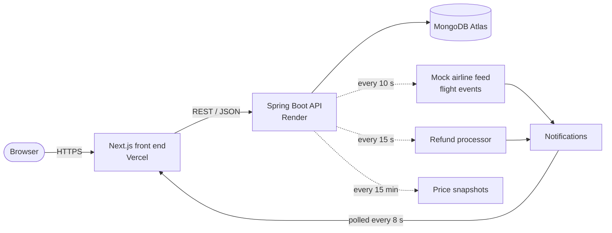

# MakeMyTrip

A full-stack travel booking website: search and book **flights, hotels, homestays, holiday packages, trains, buses, cabs, forex and travel insurance**, with live flight tracking, dynamic pricing, refunds, reviews and personalised recommendations.

**All five internship features are built and working**: live flight status, dynamic pricing, cancellation and refunds, reviews and ratings, and personalised recommendations. Each is listed below with a link to its documentation.

**Stack:** Spring Boot 3 (Java 17) + MongoDB Atlas on the back end; Next.js 15 (React 19) + Redux Toolkit + Tailwind CSS on the front end.
All data is demo data and no real payment is ever taken.

| | |
|---|---|
| **Live site (front end)** | https://make-my-trip-theta.vercel.app |
| **Live API (back end)** | https://makemytrip-qgai.onrender.com |
| **Source** | this repository |

> The back end runs on a free Render plan, which sleeps when idle. The first request after a pause can take about a minute; please wait for it.

---

## Try it in two minutes

Two ready-made accounts exist, so nothing needs to be signed up for. The login dialog also shows them.

| Role | Username | Password | What it can do |
|---|---|---|---|
| Customer | `user` | `user123` | Search, book, cancel, review, follow flights |
| Admin | `admin` | `admin123` | Everything above, plus the **Admin** area |

Anyone can also sign up with their own email (sign-up always creates a customer).

**A short tour that touches every feature** (the full step-by-step list is in [docs/TESTING-GUIDE.md](docs/TESTING-GUIDE.md)):

1. **Search and book.** On the home page open the *Flights* tab, pick any route and book a seat. Note the "Why this price?" button on the price.
2. **Live flight status.** Open **My Flights**; the flight you booked is already followed. In another window log in as admin, open **Admin → Flight Ops** and press **+1h** on that flight. A notification arrives on the bell within seconds.
3. **Price freeze and history.** On any booking page look at the price chart and press **Freeze for 24 hours**. See **My Trips → Price freezes**.
4. **Cancel and refund.** In **My Trips** press **Cancel / modify**, choose a reason, and see exactly what you get back and why. Watch the refund move through *Requested → Processed → Completed*.
5. **Reviews.** On any hotel page press **Write a review**, add stars, text and a photo. Try *Helpful*, *Reply* and *Report*. Moderate in **Admin → Reviews**.
6. **Recommendations.** On the home page, scroll to **Recommended for you**. Press **Why this?** on a card, then give a thumbs up or down and watch the list change.

---

## Features by internship task

| # | Feature | In short | Documentation |
|---|---|---|---|
| 1 | **Live flight status & notifications** | Flights move scheduled → boarding → departed → landed on their own. Delays, gate changes and cancellations come with reasons and revised times. Customers follow several flights and get notifications. | [docs/TASK-1-FLIGHT-STATUS.md](docs/TASK-1-FLIGHT-STATUS.md) |
| 2 | **Dynamic pricing, history & price freeze** | Prices follow season, weekend, booking window, time of day, demand and a small market drift, with every adjustment shown. Price history chart with forecast. Lock a price for 6/24/48 h. | [docs/TASK-2-DYNAMIC-PRICING.md](docs/TASK-2-DYNAMIC-PRICING.md) |
| 3 | **Cancellation & refunds** | Cancel from My Trips with a required reason, fully or partly. The refund follows a clear policy, and a tracker shows its status and expected date. | [docs/TASK-3-CANCELLATION-REFUNDS.md](docs/TASK-3-CANCELLATION-REFUNDS.md) |
| 4 | **Reviews & ratings** | 1–5 stars, text and photos; helpful votes, replies, reporting with moderation; sorting by helpful, newest, highest and lowest. | [docs/TASK-4-REVIEWS-RATINGS.md](docs/TASK-4-REVIEWS-RATINGS.md) |
| 5 | **Personalised recommendations** | Suggestions from your bookings, searches and views and from similar travellers, each with a "Why this?" explanation and helpful / not relevant buttons that change what you see next. | [docs/TASK-5-RECOMMENDATIONS.md](docs/TASK-5-RECOMMENDATIONS.md) |

More documents: [Architecture](docs/ARCHITECTURE.md) · [Data model](docs/DATA-MODEL.md) · [API reference](docs/API.md) · [Testing guide](docs/TESTING-GUIDE.md) · [Admin guide](docs/ADMIN-GUIDE.md) · [Deployment & submission guide](docs/DEPLOYMENT.md)

---

## How it fits together



More detail, including a booking sequence diagram, is in [docs/ARCHITECTURE.md](docs/ARCHITECTURE.md).

---

## Run it on your own computer

You need **Java 17+**, **Node 18+** and a free **MongoDB Atlas** cluster.

1. **Database.** Copy `.env.example` to `.env` and put in your Atlas connection string:
   ```
   MONGODB_URI=mongodb+srv://<user>:<password>@<cluster-host>.mongodb.net/?retryWrites=true&w=majority
   ```
2. **Back end** (port 8080), from the project root:
   ```
   ./mvnw spring-boot:run
   ```
   On first start it fills the database with demo data and creates the two accounts.
3. **Front end** (port 3000):
   ```
   cd makemytrip-clone
   npm install
   npm run dev
   ```
   Open http://localhost:3000. To use another back end, set `NEXT_PUBLIC_BACKEND_URL`. Set `NEXT_PUBLIC_SITE_URL` to the public address so links and the sitemap are right.

### Deploying

Full step-by-step instructions, a first-run routine and a submission checklist are in [docs/DEPLOYMENT.md](docs/DEPLOYMENT.md). In short:

| Part | Where | Settings |
|---|---|---|
| Back end | Render, using the included `Dockerfile` | Environment variable `MONGODB_URI` |
| Front end | Vercel, root directory `makemytrip-clone` | `NEXT_PUBLIC_BACKEND_URL`, `NEXT_PUBLIC_SITE_URL` |
| Database | MongoDB Atlas | Network access must allow Render (for example `0.0.0.0/0` for a demo) |

### Demo data

The back end loads any missing demo data every time it starts, and creates new flights when the old ones have passed. In **Admin → Dashboard → Demo data**:

- **Load missing demo data** adds only what is missing and deletes nothing.
- **Reset demo data** replaces all demo flights, hotels, services, price history, demo reviews and demo travellers with fresh ones. User accounts, bookings and refunds are kept, as is anything an admin added by hand. Run it once after a new deployment, and again just before showing the project so the flights cover the coming days.

---

## Project layout

```
.
├── src/main/java/com/makemytrip/makemytrip   Spring Boot back end
│   ├── controllers/    REST endpoints
│   ├── services/       business rules (pricing, refunds, reviews, flight feed ...)
│   ├── models/         MongoDB documents
│   ├── repositories/   database access
│   └── config/         CORS, error handling, start-up data
├── makemytrip-clone/                         Next.js front end
│   └── src/
│       ├── pages/      one file per page (home, booking pages, profile, tracker, admin ...)
│       ├── components/ reusable UI (booking panel, price chart, review section ...)
│       ├── api/        all calls to the back end
│       └── lib/        small helpers
├── docs/                                     project documentation
├── Dockerfile                                back end container for Render
└── .env.example                              database setting template
```

---

## Known limitations

- Payments are simulated; no money moves.
- The admin screens are hidden from customers in the interface, but the admin API endpoints are not protected by server-side authentication. Add Spring Security with JWT before using this for anything real.
- The free hosting plans sleep when idle, so the first request can be slow.
- Flight, hotel and price data are generated demo data.
