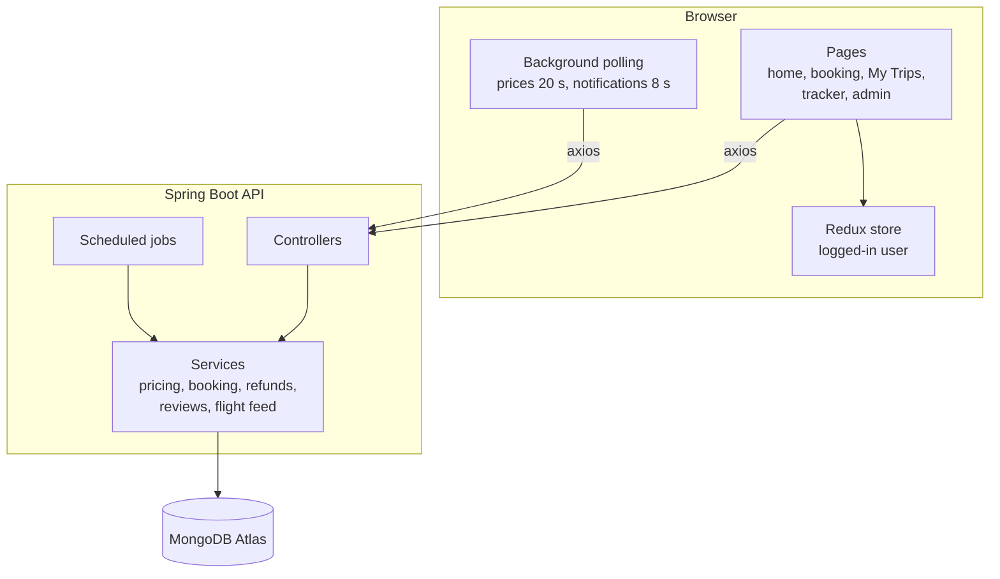
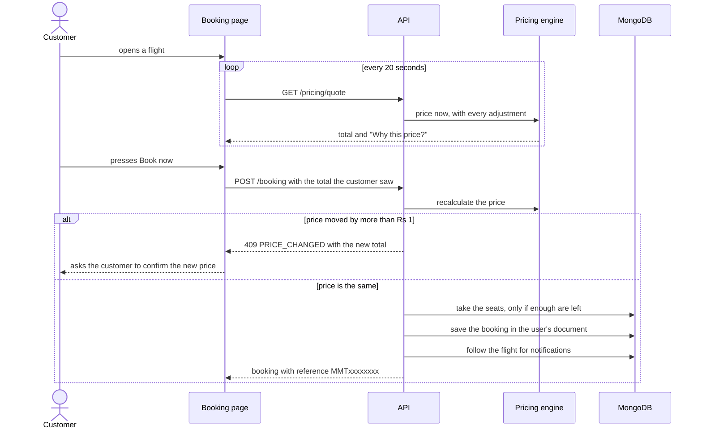
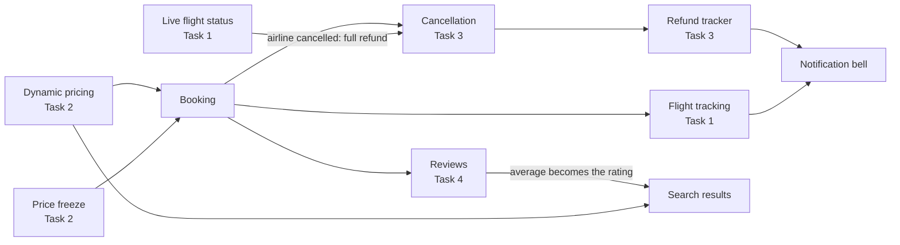

# Architecture

This page explains how the pieces of MakeMyTrip fit together and what happens when a customer books a trip.

## 1. The big picture

| Layer | Technology | Responsibility |
|---|---|---|
| Pages and components | Next.js (pages router), React, Tailwind CSS, shadcn/ui | What the customer sees; no business rules |
| State | Redux Toolkit | Remembers the logged-in user (also saved in the browser) |
| Controllers | Spring MVC | Receive requests, return JSON |
| Services | Plain Spring services | **All business rules**: the price, the refund, who may review |
| Database | MongoDB Atlas | Documents for users, flights, hotels, services, prices, refunds, reviews and notifications |

A rule that matters for honesty: **the server decides every amount.** The browser may show a price or a refund preview, but when you book or cancel, the server recalculates it. A customer cannot change what they pay by editing the page.

## 2. Scheduled background jobs

| Job | Runs | What it does |
|---|---|---|
| Mock airline feed | every 10 s | Advances flights through their phases and, now and then, announces a delay, a change or a gate change |
| Refund processor | every 15 s | Moves refunds from *Pending* to *Processed* to *Completed* after a short delay |
| Price snapshots | every 15 min | Records the current price of items people look at, book or freeze |
| Snapshot clean-up | daily at 03:30 | Removes price records older than 60 days and watches older than 7 days |
| Demo-data loader | at start-up | Adds any missing demo data and creates the two accounts |

The server's clock is fixed to India time (`Asia/Kolkata`) so flight times and "now" agree wherever it is hosted.

## 3. What happens when you book

If the price moved while you were looking, **nothing is charged** until you agree to the new total. Seats are taken with a single atomic database update, so two people cannot book the last seat.

## 4. How the five areas connect

- A booked flight is **followed automatically**, so its delays reach the bell.
- A **frozen price** is applied when you book, and the freeze fee is credited to the total.
- If the airline **cancels a flight** in the live feed, cancelling that booking gives a full refund with no reason needed.
- Refund steps and review replies use the same **notification bell** as flight updates.
- The **rating on search cards** is the average of published reviews.

## 5. Front-end structure

| Folder | Contents |
|---|---|
| `pages/` | `index` (home and search), `book-flight/[id]`, `book-hotel/[id]`, `book/[id]` (all other services), `profile` (My Trips), `tracker` (My Flights), `flight-status`, `routes`, `admin`, `info/[slug]` (policy pages) |
| `components/` | `BookingPanel`, `PriceInsights`, `PriceFreezeCard`, `CancelDialog`, `RefundList`, `RefundPolicyCard`, `Reviews`, `NotificationBell`, `admin/*` ... |
| `api/index.js` | The only place that talks to the back end |
| `lib/` | Formatting helpers, place data, live-price hook, site settings |

## 6. Security and honesty notes

- Passwords are stored as BCrypt hashes.
- Demo accounts are shown on the login dialog on purpose, so a tester can use the site immediately.
- The admin interface is hidden from customers, but the admin API has no server-side authentication. This is listed as a known limitation; the fix is Spring Security with JWT.
