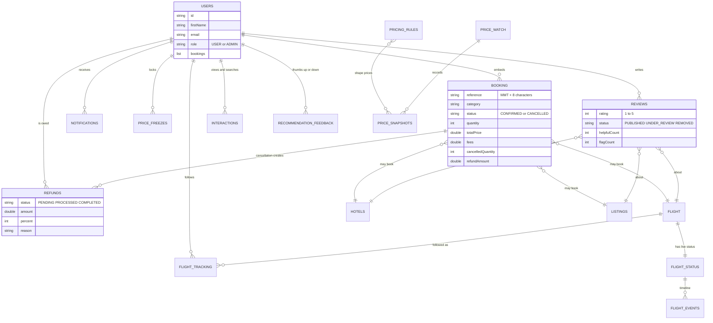

# Data model

MongoDB stores one collection per kind of record. Bookings are not a collection of their own: each booking is stored **inside its customer's user document**, which keeps a customer's whole history in one read.

## Collections at a glance

## What each collection holds

| Collection | Holds | Main fields |
|---|---|---|
| `users` | Accounts and, embedded, their bookings | name, email, BCrypt password, role, phone, `bookings[]` |
| `flight` | Flights | flight name, from, to, departure, arrival, price, seats left, capacity |
| `hotels` | Hotels | name, location, price per night, rooms left, amenities, image, rating, capacity |
| `listings` | Homestays, holidays, trains, buses, cabs, forex, insurance (one collection, a `category` field) | name, category, from, to, times, price, unit, available, rating |
| `flight_status` | Live state of each upcoming flight | phase, delay minutes, reason, gate, terminal, scheduled and estimated times |
| `flight_events` | The timeline of changes to a flight | type, message, reason, old and new departure and arrival |
| `flight_tracking` | Which user follows which flight | user, flight number, source (booked or manual) |
| `notifications` | Bell messages for any feature | user, type, title, message, read flag |
| `pricing_rules` | Season rules | name, category, start and end date, percent, active |
| `price_snapshots` | Recorded prices over time | item key, price, base price, adjustment, time, source (live or estimated) |
| `price_watch` | Items people looked at, so history keeps growing | category, item, travel date, last viewed |
| `price_freezes` | Locked prices | user, item, locked unit price, fee, hours, expires, status |
| `refunds` | Refund tracker records | booking reference, quantity, paid, fee, percent, amount, reason, status, timestamps, expected date |
| `interactions` | What customers viewed or searched (and the demo travellers' bookings) | user, category, item, type (`VIEW`, `SEARCH`, `BOOK`), destination, source, time, demo flag |
| `recommendation_feedback` | Helpful / not-relevant answers | user, item, destination, verdict (`HELPFUL`, `IRRELEVANT`), time |
| `reviews` | Ratings and reviews | item, user, rating, title, text, photos, helpful count, replies, flags, status |

## Booking fields (inside a user)

| Field | Meaning |
|---|---|
| `reference` | Customer-facing reference such as `MMT7K2Q9XA` |
| `category`, `bookingId` | What was booked: flight, hotel, homestay, holiday, train, bus, cab, forex, insurance, and its id |
| `status` | `CONFIRMED` or `CANCELLED` (partly cancelled bookings stay `CONFIRMED`) |
| `quantity`, `nights`, `travelDate` | How many, how long, and when |
| `totalPrice`, `unitPrice`, `basePrice`, `adjustmentPct` | What was paid, and the dynamic-price breakdown |
| `priceFrozen`, `freezeCredit` | Whether a freeze set the price, and the credited fee |
| `fees` | Non-refundable booking fee included in the total |
| `cancelledQuantity`, `refundAmount`, `cancelReason`, `cancelledAt` | Cancellation record |

## Demo data flag

Generated rows (including the demo travellers' activity) carry `demo = true`. **Reset demo data** deletes and recreates only those, so anything an admin adds by hand is kept. Customers' bookings, accounts and refunds are never touched.
