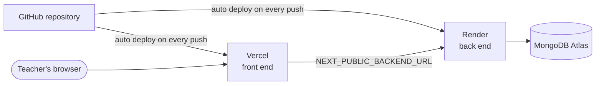

# Deployment and submission guide

How to put MakeMyTrip on the internet, and how to check it before handing it in. It uses only free plans:

| Part | Service | What it hosts |
|---|---|---|
| Database | **MongoDB Atlas** | All the data |
| Back end | **Render** | The Spring Boot API |
| Front end | **Vercel** | The Next.js website (this is the link you give out) |



**Order matters:** set up Atlas, then Render (so you have the back end address), then Vercel (which needs that address).

---

## Part 1: MongoDB Atlas (once)

1. Create a free cluster at cloud.mongodb.com if you do not have one.
2. **Database Access:** make sure a database user exists with *Read and write to any database*. Keep its username and password.
3. **Network Access → IP Access List:** there must be a row `0.0.0.0/0` (Allow access from anywhere), status Active. If it is missing: **Add IP Address → Allow Access From Anywhere → Confirm**. Render's address changes, so it cannot be listed individually.
4. **Connection string:** Clusters → **Connect → Drivers**. It looks like:
   ```
   mongodb+srv://<username>:<password>@<cluster-host>.mongodb.net/?retryWrites=true&w=majority&appName=main
   ```
   Put your real username and password in. Use a password made of letters and numbers; symbols such as `@` or `/` must be URL-encoded. Do **not** add `tlsAllowInvalidCertificates`; it turns off security checks and Render does not need it.

---

## Part 2: Back end on Render

1. Go to **render.com** and sign in with GitHub.
2. **New → Web Service**, choose **Build and deploy from a Git repository**, and pick your `MakeMyTrip` repository.
3. Fill in the form:

   | Setting | Value |
   |---|---|
   | Name | anything, for example `makemytrip-api` |
   | Language | **Docker** (the `Dockerfile` in the project root does the whole build) |
   | Branch | `main` |
   | Region | the one closest to you |
   | Instance type | **Free** |
   | Health Check Path | `/` (found under *Advanced*; the API answers "It's running") |

4. Open **Environment Variables → Add Environment Variable**:

   | Key | Value |
   |---|---|
   | `MONGODB_URI` | the connection string from Part 1 |

   Render supplies the `PORT` itself and the app reads it.
5. Press **Create Web Service**. The first build takes about **5 to 10 minutes** (it builds the Java project). Watch the **Logs** tab. It is finished when you see `Started MakemytripApplication` and the service shows **Live**.
6. Copy the address at the top, for example `https://makemytrip-api.onrender.com`.
7. **Test it:** open `https://makemytrip-api.onrender.com/flight` in a browser. A long list of flights means the back end and database work.

> **Free plan sleep:** Render stops a free service after about 15 minutes without visitors, and the next visit takes around a minute to wake it. This is normal. Open the back end link a few minutes before anyone looks at the project.

If the build fails, open the **Logs** and see [Troubleshooting](#troubleshooting).

---

## Part 3: Front end on Vercel

1. Go to **vercel.com** and sign in with GitHub.
2. **Add New → Project**, then **Import** the `MakeMyTrip` repository.
3. Set up the project:

   | Setting | Value |
   |---|---|
   | Framework Preset | Next.js (detected automatically) |
   | **Root Directory** | **`makemytrip-clone`** (press *Edit* and choose the folder; very important, the website lives there) |
   | Build and output settings | leave as they are |

4. Open **Environment Variables** and add:

   | Key | Value |
   |---|---|
   | `NEXT_PUBLIC_BACKEND_URL` | your Render address, with **no `/` at the end** |
   | `NEXT_PUBLIC_SITE_URL` | your Vercel address (see the next step; you can add it after the first deploy) |

5. Press **Deploy**. It takes 1 to 3 minutes. When it says **Congratulations**, press **Visit**. That address (for example `https://make-my-trip.vercel.app`) is the link you give out.
6. Go to **Settings → Environment Variables**, set `NEXT_PUBLIC_SITE_URL` to that address, then **Deployments → ⋯ → Redeploy**. This makes links and the sitemap use the right address.

> `NEXT_PUBLIC_` values are read when the site is *built*. Whenever you change one, redeploy.

---

## Part 4: First run

1. Open the Vercel link. If the page says it cannot load data, the back end is still waking up: wait a minute and refresh.
2. Log in as **admin / admin123** → **Admin → Dashboard → Demo data → Reset demo data** → confirm. It takes about 40 seconds and shows a message when done. This creates fresh flights, hotels, services, price rules, reviews and demo travellers.
3. Log out, log in as **user / user123** and look around.

---

## Updating after you change code

Both services watch your GitHub `main` branch. **Every push redeploys automatically**: Render in about 5 minutes, Vercel in about 2. You do not need to touch either dashboard. Do not press *Reset demo data* after every redeploy; the back end already loads anything missing when it starts. Press it only when the data needs refreshing (see below).

---

## Submission checklist

Do these on the **live site**, in this order, close to the moment you submit.

### A. Deployment is current
- [ ] GitHub shows your last commit, and the commit date is right.
- [ ] Render dashboard says **Live** for the latest commit; Vercel shows **Ready** (green) for the latest deployment.
- [ ] The README on GitHub shows all five features, and the `docs` folder is visible.

### B. Wake the back end
- [ ] Open `https://<your-render-address>/flight`. It may take a minute the first time. Refresh until you see data.

### C. Reset the demo data (the "reset button")
- [ ] Log in as **admin / admin123** on the Vercel site.
- [ ] **Admin → Dashboard → Demo data → Reset demo data** → confirm. Wait for the green message.

  *What it does:* deletes and recreates the generated flights, hotels, services, reviews and demo travellers so flights cover the coming days. It **keeps** accounts and other customers' bookings and refunds, but clears the demo customer `user` (bookings, refunds, notifications) so that account starts clean. Old items get new ids, so a link to an old item may stop working.
  *When to press it:* once after the very first deploy, and once right before you submit. Not in between.

### D. Click through every feature (about 10 minutes)

| # | Check | Pass when |
|---|---|---|
| 1 | Home page loads on a phone-width window too | No sideways scrolling, search works |
| 2 | Log in as `user` / `user123` | Name shows in the top bar |
| 3 | Flights tab → search → open one → **Book Now** | Booking confirmed; appears in **My Trips** |
| 4 | **Why this price?**, price history chart, **Freeze for 24 hours** | List of adjustments; chart; freeze appears in My Trips |
| 5 | **My Flights**; as admin **Admin → Flight Ops → +1h** on a followed flight | Notification pops up within seconds |
| 6 | **My Trips → Cancel / modify** → pick a reason → confirm | Refund amount and reason shown; **Refunds** section tracks it |
| 7 | **Admin → Refunds** | The refund is listed; buttons move it forward |
| 8 | Open a hotel → **Write a review** with stars, text, photo | Review appears at the top; rating updates |
| 9 | **Helpful**, **Reply**, **Report**; **Admin → Reviews** | Works; reported review shows up for the admin |
| 10 | Home page → **Recommended for you** → **Why this?** and thumbs up and down | Reasons shown; thumbs-down removes the card |
| 11 | Sign up a **new** account (any email) | Account created; book something small |
| 12 | Footer links: Cancellation & Refunds, How Pricing Works | Pages open |

### E. Last steps
- [ ] Fill in the **Live site** and **Live API** links near the top of the README (`README.md`) with the real addresses and push.
- [ ] Optional: open the site in a private window to be sure it works without being logged in as you.

### F. What to send
1. The **Vercel link** (the live website).
2. The **GitHub link** (`https://github.com/PawanBhandari03/MakeMyTrip`).
3. A line telling the reviewer: *"Log in as `user` / `user123`, or `admin` / `admin123` for the admin area. The README has a two-minute tour and the docs folder explains every feature with diagrams. The first load may take a minute because the free back end sleeps."*

---

## Troubleshooting

| Problem | Likely cause and fix |
|---|---|
| Vercel: **"Vulnerable version of Next.js detected"** | The project must use Next.js 15.5.27 or newer. The repository already does; make sure the latest code is pushed and redeploy |
| Vercel build fails with *"Cannot find module"* or no pages | **Root Directory** must be `makemytrip-clone` |
| Website loads but every list is empty, or "could not load" | `NEXT_PUBLIC_BACKEND_URL` is missing, wrong or ends with `/`. Fix it, then **Redeploy** on Vercel. Also check that the Render link opens `/flight` |
| Browser console shows a blocked request (CORS) | Usually the back end is asleep or crashed. Open the Render link and check its **Logs**; the API allows any origin |
| Render build fails | Open **Logs**. Check Language is **Docker** and Branch is `main`. Re-run with **Manual Deploy → Clear build cache & deploy** |
| Render says *Live* but `/flight` times out or errors | Open **Logs**. If you see `MongoTimeoutException` or *authentication failed*: Atlas Network Access must contain `0.0.0.0/0`, and the username and password in `MONGODB_URI` must be right |
| Render logs show an SSL or certificate error | Rare. Check the connection string has no stray characters; as a last resort only, append `&tlsAllowInvalidCertificates=true` |
| Everything is slow the first time | The free Render service was asleep; wait about a minute |
| Flights list is empty after a while | The demo flights cover about two weeks from the last reset. The back end also creates new ones whenever it wakes up and finds them running out; to refresh them at once, run **Reset demo data** again |
| Changes do not appear on the live site | Wait for both dashboards to finish deploying, then hard refresh (Ctrl+F5) |
| Cannot log in | Use `user` / `user123` or `admin` / `admin123`. If the database was recreated, the back end creates these on start-up |
