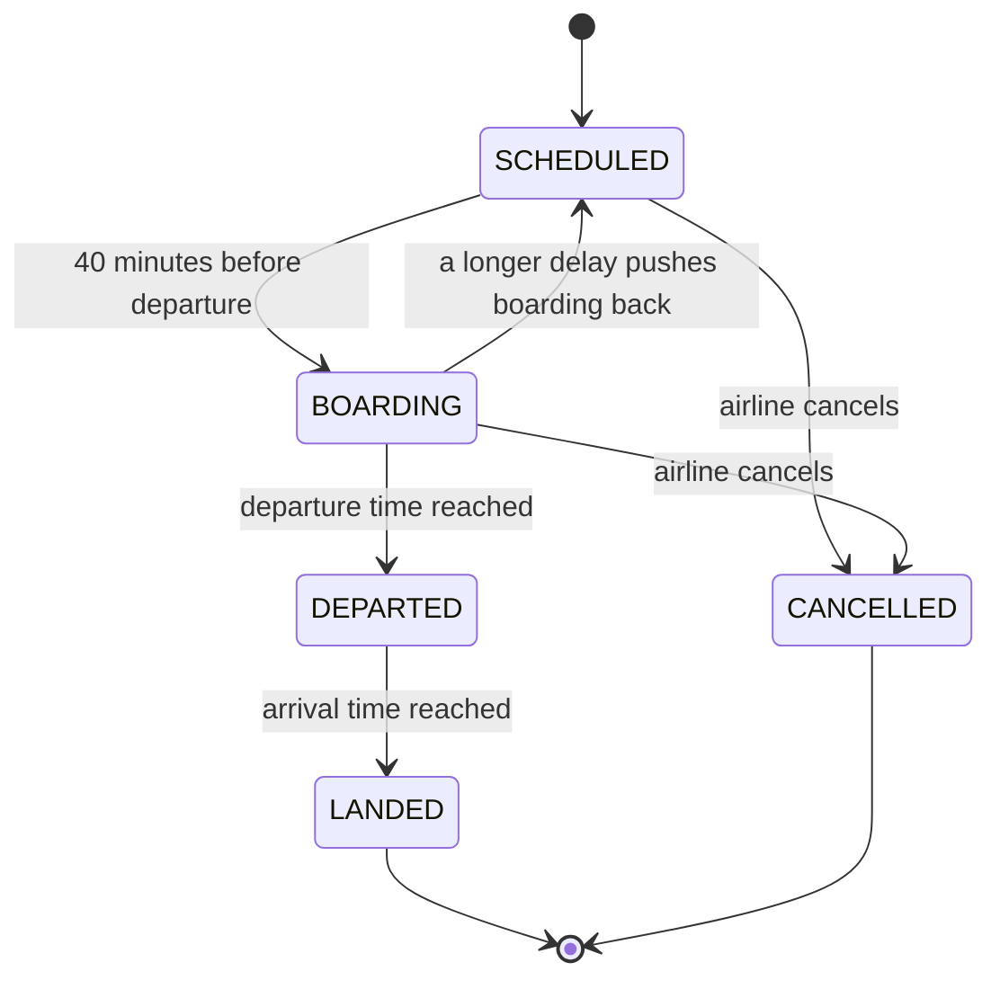
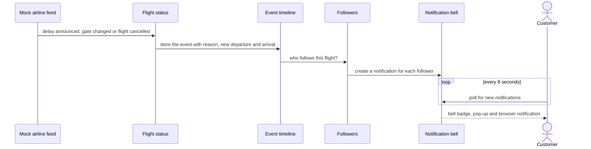
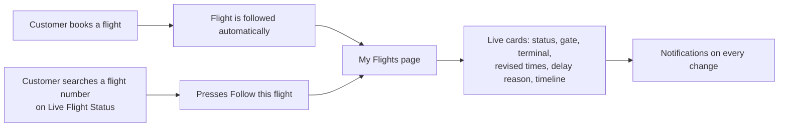

# Task 1: Live flight status, tracking and notifications

## What it does

Every flight leaving in the next three days has a **live status record** that changes on its own, like a real airline system. Customers can follow several flights at once, see a revised departure and arrival time, read the reason for any delay, and get a notification whenever something changes.

| Requirement | How it is done |
|---|---|
| Mock API with delay and boarding updates | A built-in mock airline feed plus a public mock API under `/mock-api/flights` |
| Notifications for time changes, delays, ETAs | Bell notifications, an on-screen pop-up and (if allowed) a browser notification |
| Delay reasons and revised schedules | Every event carries a reason and the new departure and arrival times |
| Tracking multiple flights | **My Flights** page; booked flights are followed automatically |
| Dynamic ETA | Estimated arrival moves with the delay and is shown live |

## A flight's life



The phase is worked out from the clock, so it is always correct even after the server restarts. The estimated times include any delay, so a 45-minute delay moves both the departure and the estimated arrival.

## How a change reaches the customer



The feed ticks every 10 seconds. Each tick, every flight has a very small chance of a new delay, a longer or shorter delay, or a gate change, and flights move through their phases as time passes. A tester does not have to wait for chance; the same events can be triggered by hand (see below).

### Kinds of notification

Delay announced, delay extended, delay reduced, back on time, gate changed, boarding, departed, landed and cancelled. Each shows the flight, what changed, the reason and the revised time.

## Following flights



## Try it yourself

1. Log in as `user` / `user123`. Open **My Flights** to see followed flights, or search a number such as `6E-126` on **Live Flight Status** and press **Follow this flight**.
2. Open another browser window and log in as `admin` / `admin123`. Go to **Admin → Flight Ops**.
3. Find the same flight and press **+1h**, **Change gate** or **Cancel flight**.
4. Within a few seconds the first window shows a pop-up and the bell number increases. Open **My Flights** to read the timeline.

The mock API can also be driven directly:

```
curl -X POST localhost:8080/mock-api/flights/6E126/events \
  -H "Content-Type: application/json" \
  -d '{"type":"DELAY","minutes":60,"reason":"Weather conditions"}'
```

`type` is one of `DELAY`, `ADD_DELAY`, `CLEAR_DELAY`, `GATE_CHANGE`, `BOARDING`, `CANCEL`.

## Where the code is

| Part | Files |
|---|---|
| Status record and phases | `FlightStatus`, `FlightStatusService` |
| Mock airline and its API | `MockFlightFeedService`, `MockFlightApiController` |
| Event timeline and notification fan-out | `FlightEvent`, `FlightEventService` |
| Following flights | `FlightTracking`, `FlightTrackingService`, `FlightTrackingController` |
| Notifications | `Notification`, `NotificationService`, `NotificationController` |
| Booking status on My Trips | `BookingStatusService` (the live status box on each booking) |
| Front end | `tracker.tsx`, `flight-status/index.tsx`, `NotificationBell.tsx`, `FlightStatusCard.tsx`, `LiveStatus.tsx`, `admin/FlightOps.tsx` |
