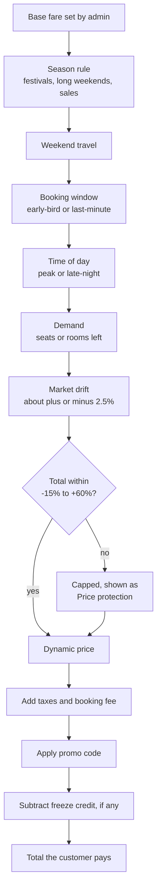
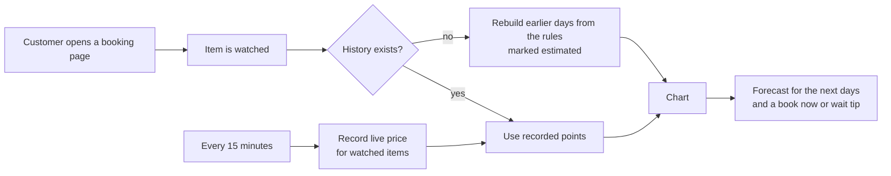
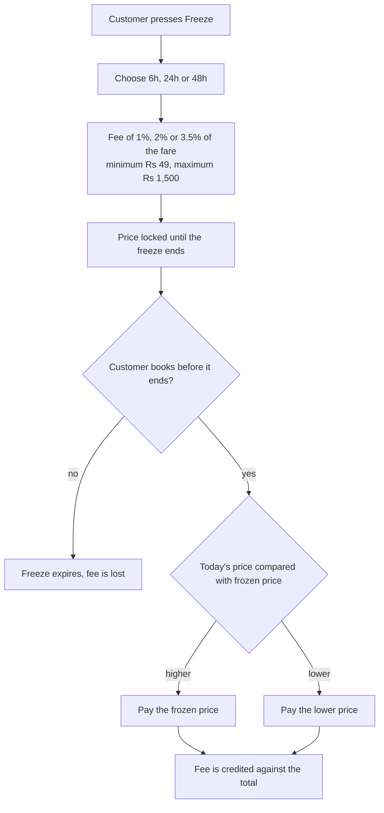

# Task 2: Dynamic pricing, price history and price freeze

## What it does

Every price starts from a **base fare** that an admin sets, and is moved by a short, visible list of adjustments. Nothing is hidden: any price has a **Why this price?** button that lists each adjustment and its reason.

| Requirement | How it is done |
|---|---|
| Demand and season adjustments (for example +20% on holidays) | Season rules managed in **Admin → Pricing**, plus demand from seats left |
| Price history graphs | Chart on every booking page, 7 or 30 days, with a forecast |
| Price freeze | Lock a price for 6, 24 or 48 hours for a small fee |
| Real-time updates | Prices refresh every 20 seconds and flash green or red |
| Transparency | The adjustment list, "Price protection" cap line and a how-it-works page |

## How a price is built

| Factor | Effect |
|---|---|
| Season rules | By travel date, for example Diwali week +20%, Durga Puja +20%, Christmas and New Year +20%, monsoon saver −10%. Edited by the admin and live within seconds. |
| Weekend | +6% for Fri to Sun transport; +8% for Fri and Sat stays |
| Booking window | Early-bird up to −8%; last-minute up to +28% for flights, trains and buses; smaller for stays |
| Time of day | +4% for peak-hour departures, −7% for late-night ones |
| Demand | +7% to +18% as seats or rooms run out, −3% while most are open (measured against each item's capacity) |
| Market movement | A slow drift of about ±2.5% that changes every 15 minutes |

The total is **capped between −15% and +60%** of the base fare so prices never go wild.

## Price history and forecast

The chart shows recorded points, earlier estimated history and a dashed forecast, with the lowest, highest and average price and the change against 7 days ago.

## Price freeze

Fixed-price items (forex and insurance) cannot be frozen. Active, used and expired freezes are listed under **My Trips → Price freezes**, with a button to book at the frozen price.

## If the price moves while you book

The booking request carries the total the customer saw. The server recalculates it, and if it differs by more than ₹1 it refuses with `409 PRICE_CHANGED`, charges nothing, and the page asks the customer to confirm the new total.

## Try it yourself

1. Open any flight or hotel booking page. Press **Why this price?** to see each adjustment.
2. Scroll to **Price history & forecast**. Switch between 7 and 30 days.
3. In the booking panel, press **Freeze for 24 hours**. Check **My Trips → Price freezes** and book at the frozen price.
4. As admin, open **Admin → Pricing**, change a season rule's percentage or dates and watch the price on a booking page for that period change.
5. Read the customer explanation at `/info/pricing`.

## Where the code is

| Part | Files |
|---|---|
| Price engine and caps | `DynamicPricingService`, `PricingRule` |
| Quote, taxes, fees, promo codes | `PricingService`, `PricingController` |
| History, forecast, snapshots | `PriceHistoryService`, `PriceSnapshot`, `PriceWatch` |
| Price freeze | `PriceFreezeService`, `PriceFreeze`, `PriceFreezeController` |
| Price-changed protection | `PriceChangedException`, `GlobalExceptionHandler` |
| Admin rules | `PricingRuleController` |
| Front end | `BookingPanel`, `PriceTag`, `PriceBreakdown`, `PriceInsights`, `PriceFreezeCard`, `PriceFreezeList`, `useLivePrices`, `admin/PricingAdmin`, `info/[slug]` |

### Promo codes

`TRIP10`, `WELCOME500`, `FLY20`, `MMTSECURE`, `SPECIALUPI`, `LUXE15`, `HOLIDAY20`, `ROADTRIP`, `INSURE10`. Each is limited to certain categories and has a minimum amount (see `PricingService`).
