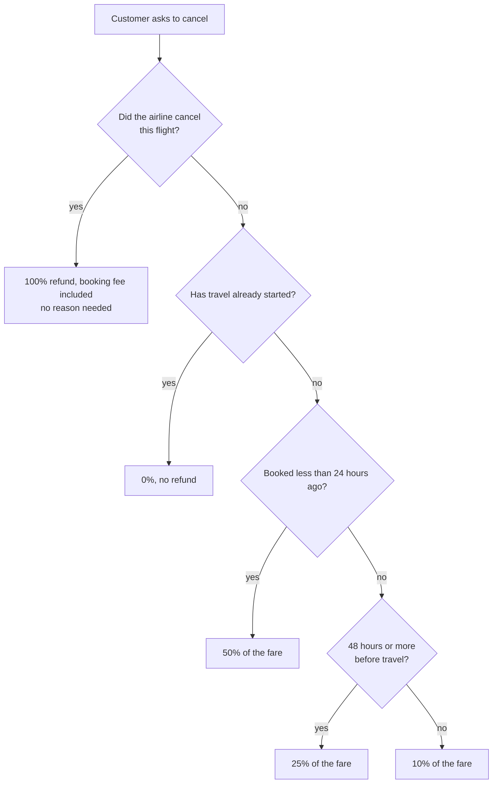
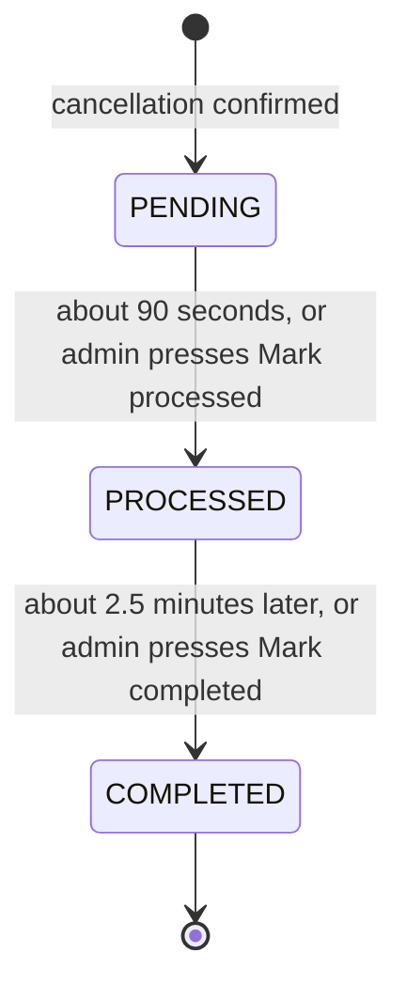
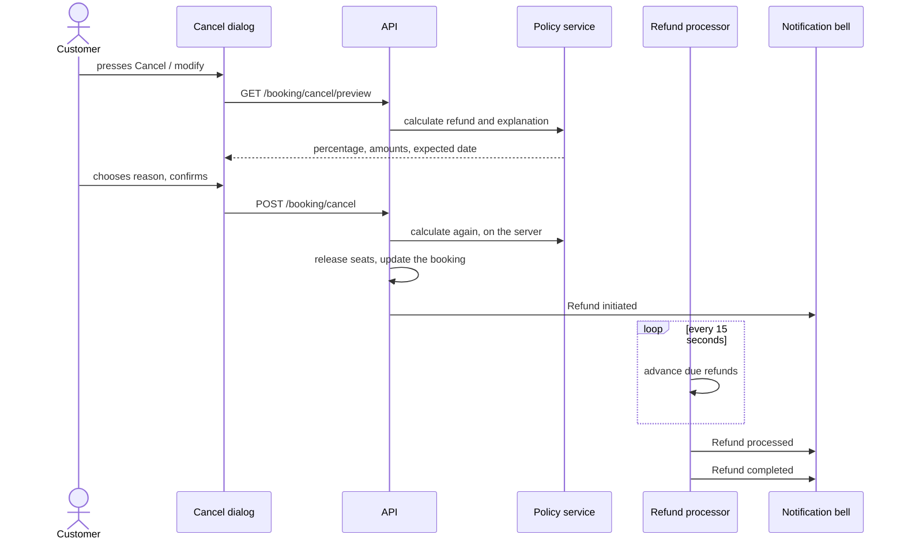

# Task 3: Cancellation and refunds

## What it does

A customer cancels from **My Trips**, chooses a required reason, and sees **exactly how much they will get back and why** before confirming. The refund follows a fixed policy, can cover only part of a booking, and is tracked through three steps with an expected date.

| Requirement | How it is done |
|---|---|
| Cancel from the dashboard | **Cancel / modify** button on every confirmed booking in My Trips |
| Auto-calculated refund by policy | One policy service decides both the preview and the real refund |
| Partial refunds | Cancel some of the seats, rooms or tickets; the refund is for that share |
| Required reason dropdown | Seven reasons; cancelling is blocked until one is chosen |
| Refund status tracker | Requested → Processed → Completed, with timestamps and an expected date |

## The refund policy



| When you cancel | Refund |
|---|---|
| Within 24 hours of booking | 50% |
| After that, more than 48 hours before travel | 25% |
| After that, less than 48 hours before travel | 10% |
| After travel has started | 0% |
| The airline cancelled the flight (from the Task 1 live feed) | 100%, including the fee |

**The calculation**

```
refund = (amount paid for the cancelled part − booking fee share) × percentage
```

The amount paid for the cancelled part is `total × cancelled units ÷ booked units`. The booking fee (flights ₹249, trains ₹35, buses ₹20) is never refunded, except when the airline cancels. A price-freeze fee was already credited into the total when booking.

**Worked example.** Two seats cost ₹13,263 in total (fee ₹249). Cancelling both within 24 hours of booking: (13,263 − 249) × 50% = **₹6,507**. The cancel dialog shows each line of this sum.

## Partial cancellation

If a booking has more than one unit, the dialog shows a stepper. Cancelling 1 of 2 seats:

- returns that one seat to the flight's stock,
- opens a refund for that part only,
- leaves the booking as **Partly cancelled**, with a **Cancel the rest** button.

When every unit is cancelled the booking becomes **Cancelled**.

## The refund tracker





A real bank takes days, so the demo moves quickly to let a tester watch every step. The tracker also shows the date a bank would realistically credit the money: **the 7th business day** (5 to 7 business days).

## Reasons

Change of plans · Found a better price elsewhere · Medical or personal emergency · Booked the wrong dates · Flight or schedule changed · Documents or visa issue · Other (with an optional note). Admins see a "Why customers cancel" chart.

## Where customers see the policy

- In the cancel dialog, with the real numbers.
- On flight, hotel and service booking pages, as a timeline with real dates and rupee amounts.
- On the full page `/info/cancellation` (linked from the footer).

## Try it yourself

1. Log in as `user` / `user123`, open **My Trips** and press **Cancel / modify** on a booking with 2 or more seats.
2. Change the stepper and watch the refund update. Pick a reason and confirm.
3. The page scrolls to **Refunds**. Watch the three steps, and the bell for each notification.
4. As admin, open **Admin → Refunds** to see the queue, the totals and the reasons chart. Press **Mark processed** to speed one up.
5. To see the 100% case, cancel a flight in **Admin → Flight Ops**, then cancel that booking as the customer.

## Where the code is

| Part | Files |
|---|---|
| Policy and preview | `RefundPolicyService` |
| Cancelling and stock release | `BookingService.cancel`, `BookingController` |
| Refund records, tracker and stats | `Refund`, `RefundService`, `RefundController` |
| Front end | `CancelDialog`, `RefundList`, `RefundPolicyCard`, `admin/RefundsAdmin`, `profile/index.tsx`, `info/[slug]` |
