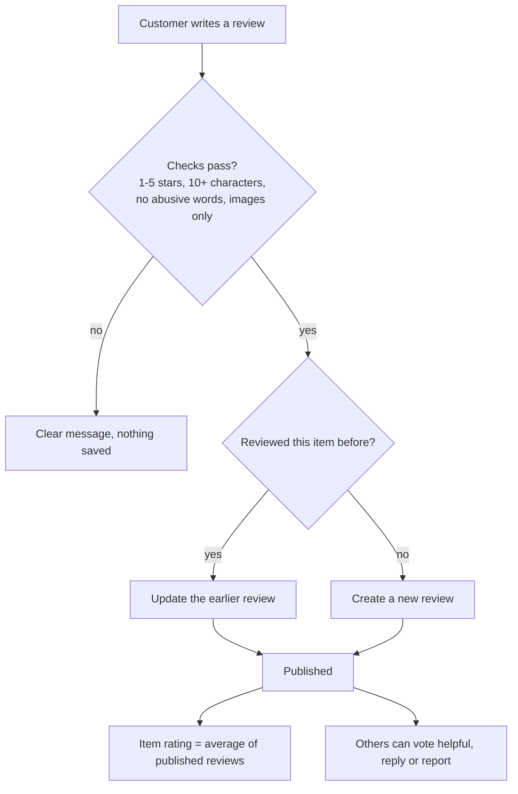
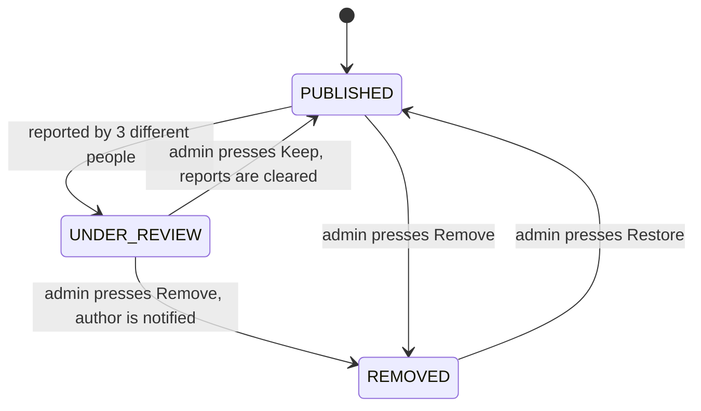
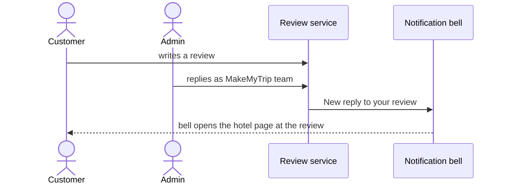

# Task 4: Reviews and ratings

## What it does

Every hotel, stay, holiday package, flight, train, bus and cab has a **Ratings & reviews** section. Customers rate with stars, write, attach photos, vote reviews helpful, reply and report. Reported reviews are hidden and moderated by an admin.

| Requirement | How it is done |
|---|---|
| 1–5 star rating and text | Star picker and a text box (10 to 1,500 characters) |
| Photo upload | Up to 3 pictures, shrunk in the browser before upload |
| Replies | Anyone logged in can reply; admin replies are marked **Official** |
| Flagging with moderation | Report with a reason; three different reports hide the review until an admin decides |
| Sorting | Most helpful, newest, highest rated, lowest rated |

## Life of a review

- One review per person per item; writing again edits it. A customer can also delete their own.
- A **Verified booking** badge appears when the reviewer has a booking for that exact item.
- Customers cannot vote on, or report, their own review, and cannot report the same review twice.

## Reporting and moderation

Reporting offers five reasons: spam or fake, offensive language, not about this item, personal information, other. In **Admin → Reviews** the admin sees every reported review with the list of reasons and chooses *Keep*, *Remove* or *Restore*. Hidden reviews do not count towards the rating.

## Replies and notifications

The author is also notified if a moderator removes their review.

## Ratings and sorting

- The summary shows the average, the number of reviews and a 5-to-1 star bar chart.
- The rating on search cards is the average of published reviews, so they stay in step.
- Sorting happens on the server; a "Show more reviews" button loads further pages.

## Demo reviews

About 1,800 demo reviews are generated for hotels, homestays and holiday packages, with varied wording, dates, helpful counts and a few admin replies, so every page looks lived in. Real reviews mix in with them. **Reset demo data** regenerates the demo ones and removes only those.

## Try it yourself

1. Open any hotel page and scroll to **Ratings & reviews**. Try the sort buttons.
2. Log in as `user` / `user123`, press **Write a review**, choose stars, write a few sentences, add a photo and submit.
3. Press **Helpful** on another review, then **Reply**.
4. Press **Report** on a review. To see the auto-hide, report it from three different accounts (sign up two more).
5. As admin, open **Admin → Reviews** and press **Keep** or **Remove**.
6. In **My Trips**, press **Rate & review** on a booking to jump straight to its review box.

## Where the code is

| Part | Files |
|---|---|
| Rules, voting, replying, reporting, moderation | `ReviewService`, `Review`, `ReviewRepository` |
| Demo reviews | `ReviewSeeder` |
| Endpoints | `ReviewController` |
| Front end | `Reviews.tsx` (list, write dialog, report dialog), `StarRating.tsx`, `admin/ReviewsAdmin.tsx`, `NotificationBell.tsx` |
