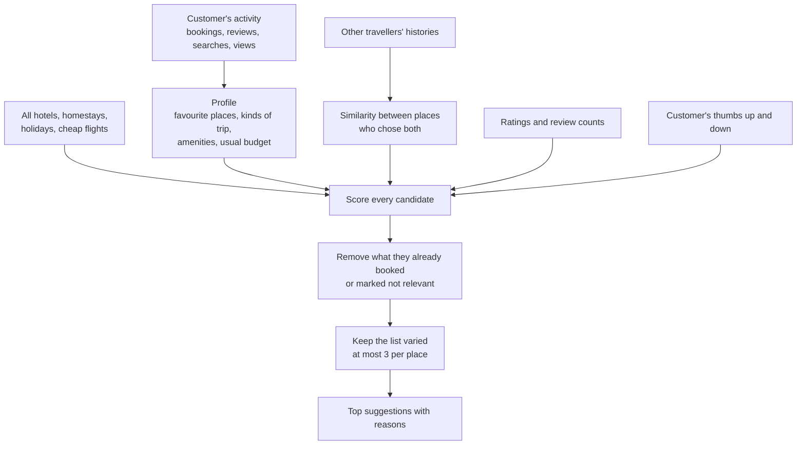
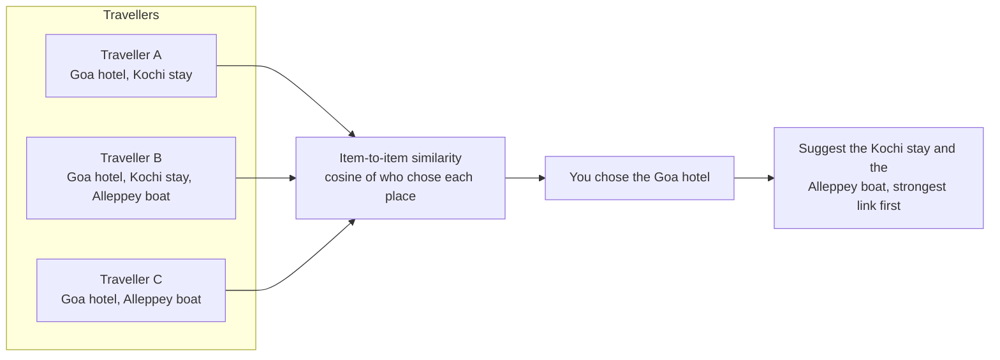
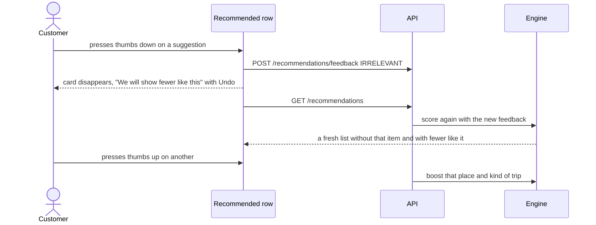

# Task 5: Personalised recommendations

## What it does

A **Recommended for you** row on the home page (and **Recommended for your next trip** in My Trips) suggests hotels, homestays, holiday packages and flights based on what the customer has booked, reviewed, searched and viewed, and on what similar travellers chose. Every suggestion explains itself, and the customer can say whether it was helpful.

| Requirement | How it is done |
|---|---|
| History-based suggestions | Bookings, reviews, searches and page views build a profile of favourite places, kinds of trip, amenities and budget |
| "Why this recommendation?" tooltip | A **Why this?** button on every card lists the reasons and shows how the score was made up |
| Collaborative filtering | "Travellers who chose X also chose Y", from how often places appear together in different travellers' histories |
| Helpful / irrelevant feedback loop | Thumbs up and down on each card change what is shown next; *not relevant* removes the item at once, with an Undo |

## How a suggestion is chosen

### The score

| Part | Weight | What it measures |
|---|---|---|
| **Your history** | 35% | How strongly the place, the kind of trip and the amenities match what you chose before (bookings count most, then reviews, searches, views) |
| **Similar travellers** | 30% | How much people with overlapping histories chose this place. Only counted when at least two travellers link it to something you chose |
| **Ratings** | 20% | The review average, pulled towards a typical rating when there are only a few reviews |
| **Budget fit** | 15% | How close the price is to what you usually pick |

Then the feedback adjusts it: each *not relevant* on a place lowers other suggestions there (up to −0.36), each on a kind of trip lowers that kind a little; *helpful* raises places and kinds you liked. Items you marked *not relevant* are never shown again, and nor are items you already booked.

**New or logged-out visitors** have no history, so they see popular places: 75% rating, 25% how many people reviewed it. The home page invites them to log in for personal picks.

## Collaborative filtering

Each place becomes a list of the travellers who chose it (weighted: booked 5, reviewed well 3, viewed 1). The similarity of two places is the cosine of those lists. A place is suggested when it is strongly linked to places in *your* history, and the strongest link becomes the reason: *"Travellers who booked Royal Kochi Suites also chose this (5 travellers)"*. The model is rebuilt every 5 minutes.

**Demo travellers.** A fresh database has only two accounts, so about 60 generated demo travellers in five taste groups (beach, mountains, heritage, big cities, abroad) provide the history that similarity needs. The demo customer `user` also starts with a short beach history so the first screen is already personal.

## The feedback loop

## What is recorded, and when

| Event | Recorded |
|---|---|
| Opening a flight, hotel, homestay or holiday page | A view (only when logged in; the same item is recorded at most once in 30 minutes) |
| Pressing Search with a place | A search for that place |
| Opening an item from a suggestion | A view marked as coming from a recommendation (shown to admins) |
| Booking, reviewing | Read directly from the booking and review records |

Nothing is recorded for visitors who are not logged in.

## Admin view

**Admin → Recommendations** shows the helpful and not-relevant counts, the helpful rate, visits that came from suggestions, how many travellers the similarity model has learned from, and feedback by place. **Inspect a customer** shows what the system has learned about that person (favourite places, kinds of trip, tastes) and exactly what it would suggest, with scores and reasons.

## Try it yourself

1. Log in as `user` / `user123`. On the home page, scroll to **Recommended for you**. Press **Why this?** on a card to read the reasons and the score breakdown.
2. Press the thumbs-down on a card: it disappears and an Undo bar appears. Press thumbs-up on another and see similar places rise.
3. Sign up a new account. Its suggestions are *popular places*. Open a few hotels in one city, or search for a city, then refresh: the row becomes personal with reasons such as "You looked at 3 places in Manali".
4. Open **My Trips**: the same suggestions appear at the bottom.
5. As admin, open **Admin → Recommendations**, pick a customer under **Inspect a customer** and compare their profile with what they are shown.

## Where the code is

| Part | Files |
|---|---|
| Scoring, profile, similarity model, reasons | `RecommendationService` |
| Demo travellers | `RecommendationSeeder` |
| Recorded activity and answers | `Interaction`, `RecommendationFeedback` and their repositories |
| Endpoints | `RecommendationController` |
| Front end | `Recommendations.tsx`, `lib/useTrackView.ts`, `admin/RecommendationsAdmin.tsx`; tracking in the booking pages and the home page search |
